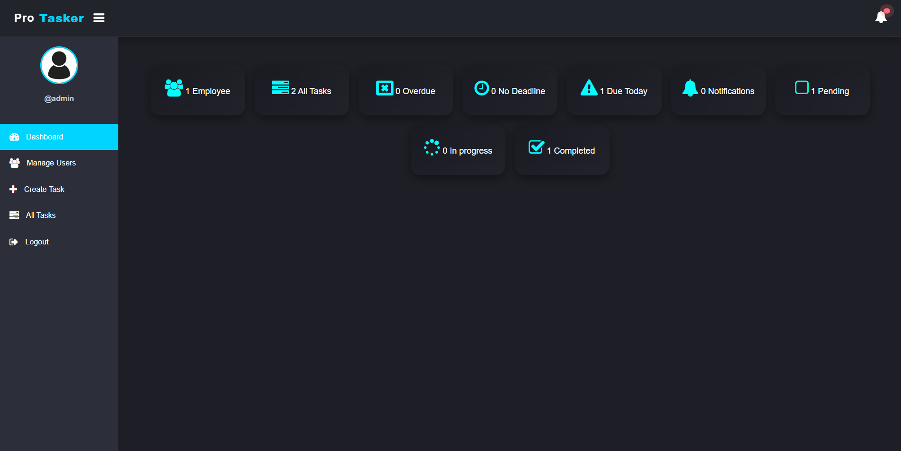

# ProTasker – Task Management System

ProTasker is a role-based task management system built with **PHP** and **MySQL**, designed to streamline task assignments, improve team collaboration, and enhance productivity. It features an **Admin Panel**, **Employee Dashboard**, and a modern, responsive user interface.

---

Website is Live : [https://protasker.ct.ws/](https://protasker.ct.ws/)


## 🚀 Features

- ✅ **User Authentication**  
  Secure login system with session-based access. Separate roles for Admin and Employee.

- 📝 **Task Management**  
  - Admins can create, assign, edit, and delete tasks.  
  - Employees can view and update task statuses.

- 🔔 **Notification System**  
  Users receive instant task notifications upon assignment.

- 📅 **Task Due Date Tracking**  
  Admins can set deadlines and monitor task progress.

- 📊 **Dashboard Overview**  
  Custom dashboards for both Admin and Employee roles.

- 💻 **Mobile-Responsive Design**  
  Built using **Bootstrap** and custom CSS with dark mode support for a sleek UI across all devices.

---

## 🛠️ Tech Stack

- **Frontend**: HTML, CSS, Bootstrap  
- **Backend**: PHP  
- **Database**: MySQL  

---

## 📂 Project Structure

```
project/
│
├── app/
│   └── Model/
│       ├── User.php
│       └── Task.php
├── inc/
│   ├── header.php
│   └── nav.php
├── css/
│   └── style.css
├── create_task.php
├── dashboard.php
├── login.php
├── logout.php
├── DB_connection.php
└── README.md
```

---

## ⚙️ Setup Instructions (Local Development)

### ✅ Step-by-step Guide:

1. **Download and Install XAMPP**  
   [https://www.apachefriends.org/index.html](https://www.apachefriends.org/index.html)

2. **Clone the Project**  
   ```bash
   git clone https://github.com/yourusername/protasker.git
   ```

3. **Move the Project Folder**  
   Place the entire project folder into:
   ```
   C:/xampp/htdocs/
   ```

4. **Update Database Connection**  
   Open `DB_connection.php` and update with your credentials:
   ```php
   $sName = "localhost";
   $uName = "your_db_username";
   $pass  = "your_db_password";
   $db_name = "your_db_name";
   ```

5. **Start XAMPP**  
   Open XAMPP Control Panel and **start** both:
   - Apache Server  
   - MySQL Server

6. **Import the SQL Database**  
   - Open `phpMyAdmin`  
   - Create a new database (e.g., `protasker`)  
   - Import the `.sql` file provided with the project.

7. **Run the Project in Browser**  
   Open browser and go to:
   ```
   http://localhost/protasker
   ```

---

## 📷 Screenshots




---

## 📩 Contact

If you have questions or want to contribute:
dasarisambasivanaidu7@gmail.com

**ProTasker** – Simplify Task Management. Maximize Productivity.
